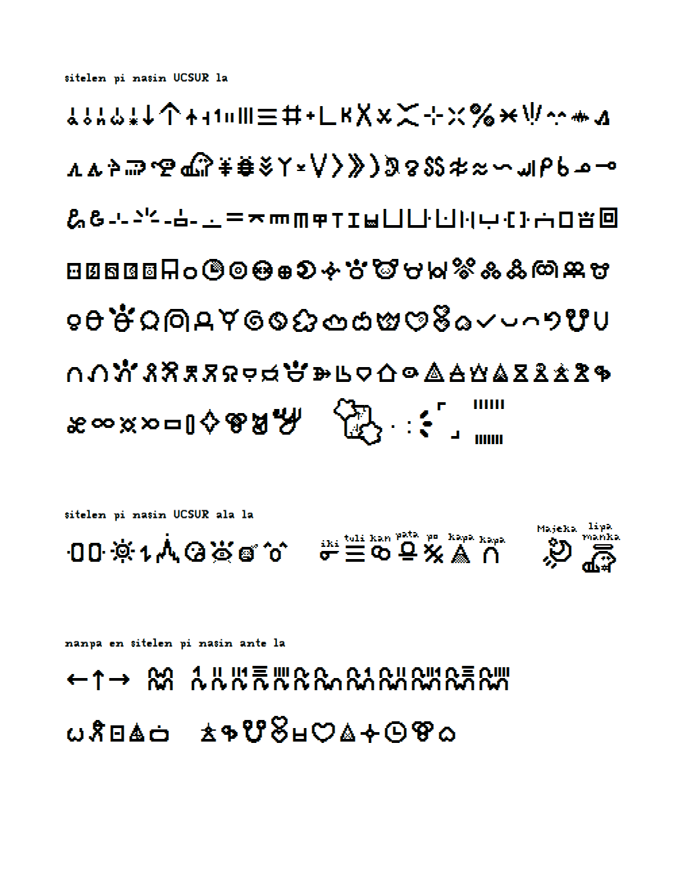
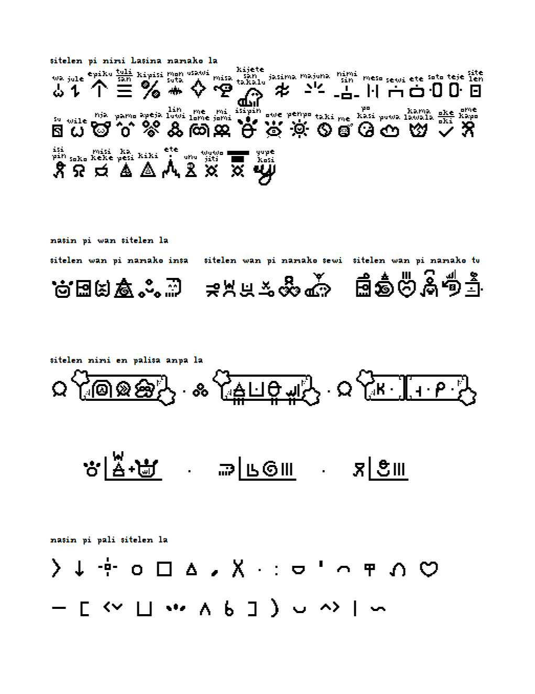
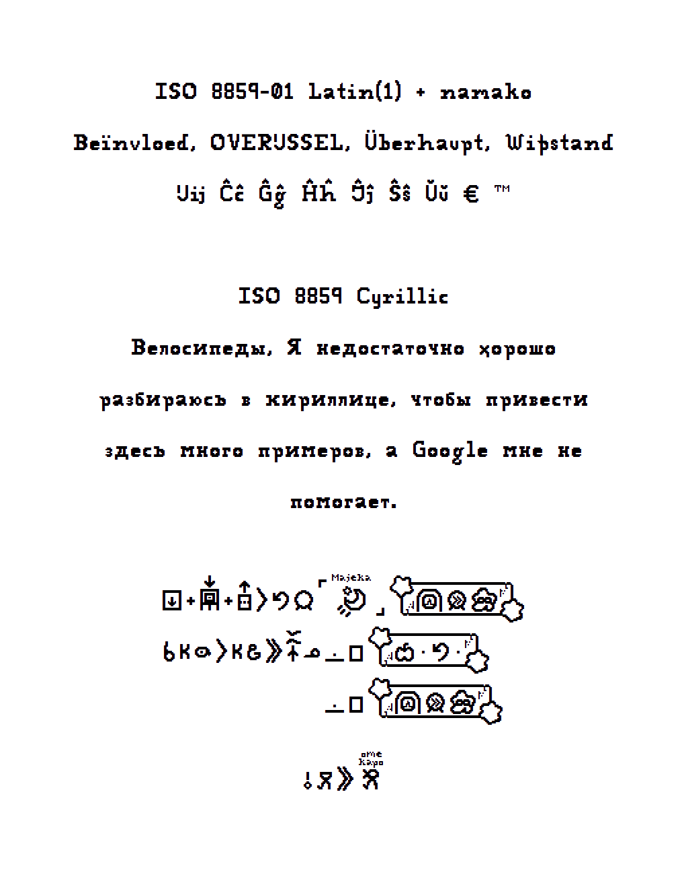

sitelen Ilosele, or Ilozellig, is a pixel font created by jan Majeka

To write non-UCSUR words, bookend the word written in Latin characters with 'L'!
such as -> 'LkapaL' 'LeteL' 'LjuleL' 'LlipamankaL'

use 2, 3, 4... / Var2, Var3, Var4... to alt a glyph, but use 1 / Var1 after some words to "unstyle" it
such as -> 'tenpoTok1' 'jeloTok1 ''wileTok1' (this show 'wileTok' without the shine, not ω-wile)

For the special number comboes, you use a Zero-Width-Joiner inbetween EVERY character
such as -> lukaTok&lukaTok&lukaTok&tuTok&wanTok for LLLTW or lukaTok&lukaTok&luka&tuliTok for LLLS

Use 9 / Var9 to add Rubytext to non-pu words, this even works for alts, just type 9 after the 2!
such as -> 'monsutaTok9' 'isipin9' 'kijetesantakalu9' 'isipin29'

Unlike what this image may suggest, any glyph you can "nest" with you can also add a stacker to! I just couldn't fit literally every combo here

This font also features Latin and Cyrillic support!

CC-BY-ND 4.0, if you want to make a derivative- talk to me!
